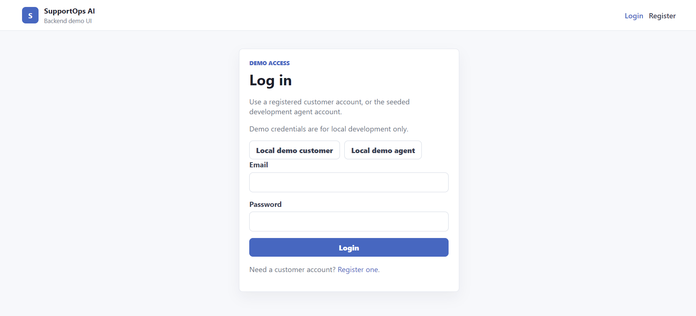
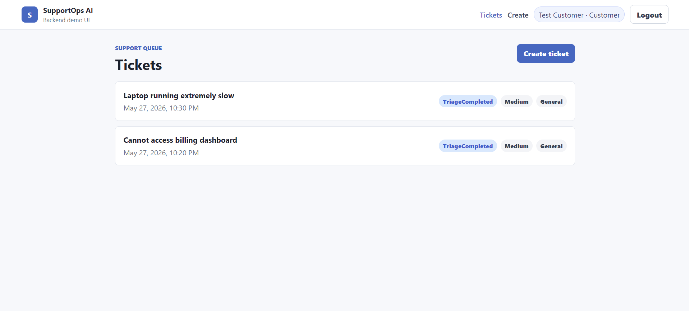
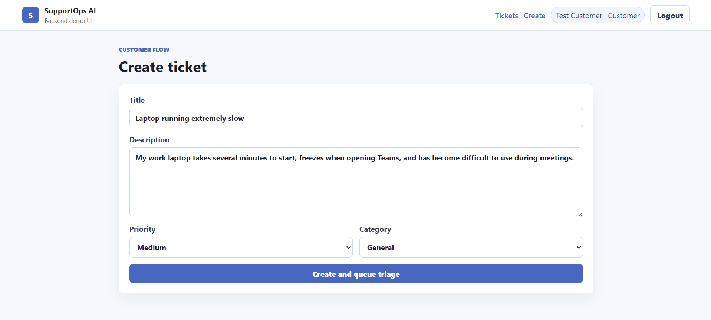
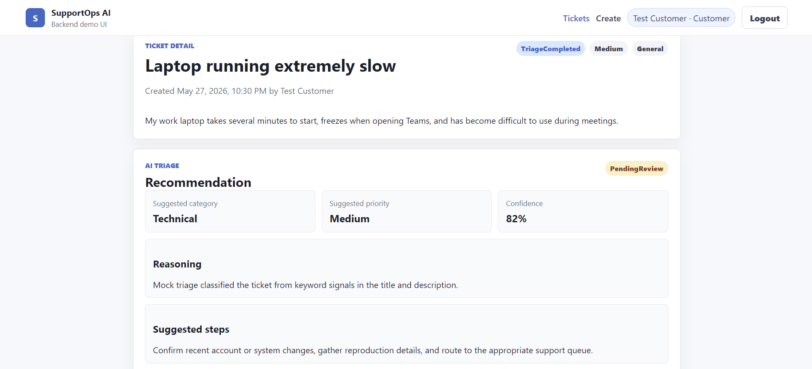
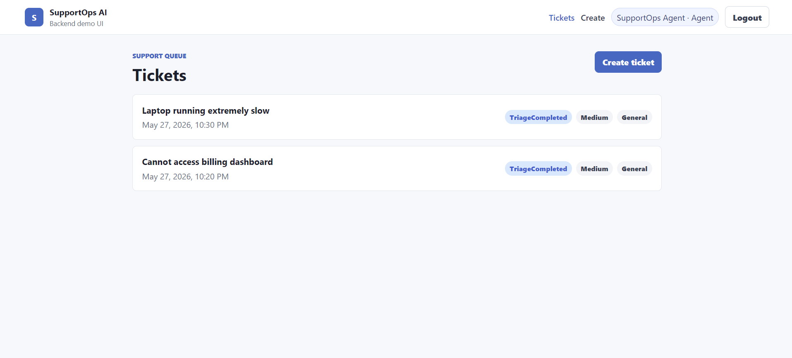
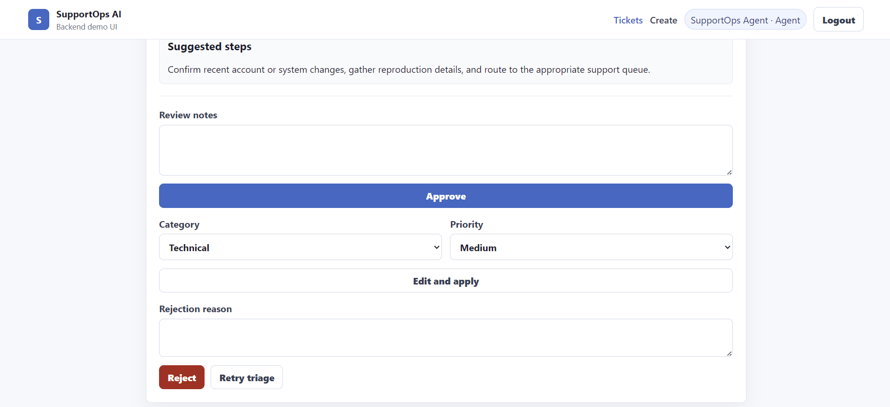
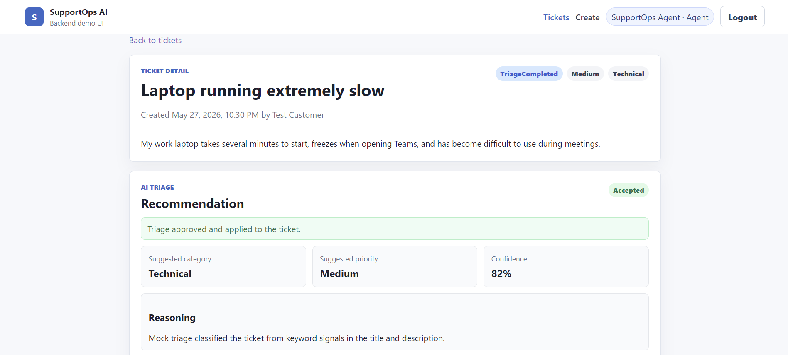

# SupportOps AI

SupportOps AI is a portfolio project that demonstrates an AI-assisted support ticket triage workflow built with ASP.NET Core, PostgreSQL, RabbitMQ, a .NET worker service, and a React demo frontend.

The project models a realistic support operations flow: customers create tickets, the backend queues triage work, a background worker generates an AI recommendation, and a human support agent reviews the result before it affects the ticket.

## Why This Project Exists

Support teams often need to classify, prioritize, and route incoming work quickly without giving up human judgment. This project explores that workflow as a practical engineering system rather than a single AI prompt. It focuses on clean backend boundaries, asynchronous processing, reviewable AI output, and a small frontend that makes the demo easy to understand.

## Core Features

- Customer registration and JWT login
- Local demo login shortcuts for customer and agent personas
- Customer ticket creation and ticket detail views
- PostgreSQL persistence through Entity Framework Core
- RabbitMQ-based asynchronous triage queue
- .NET worker service that processes triage jobs
- Mock AI triage provider for repeatable local development
- Optional OpenAI triage provider by configuration
- Agent review workflow for approving, editing, rejecting, or retrying AI triage recommendations
- Audit logging for important support workflow actions
- xUnit unit and integration test coverage
- React, TypeScript, and Vite frontend demo

## Tech Stack

- Backend: ASP.NET Core Web API, C#, .NET 8
- Frontend: React, TypeScript, Vite
- Database: PostgreSQL
- ORM: Entity Framework Core
- Messaging: RabbitMQ
- Background processing: .NET Worker Service
- Authentication: JWT bearer tokens
- AI: mock provider by default, OpenAI provider available through configuration
- Testing: xUnit
- Local infrastructure: Docker Compose

## Architecture Summary

The solution follows clean architecture-inspired boundaries:

- `SupportOpsAI.Domain` contains entities and enums with no dependency on outer layers.
- `SupportOpsAI.Application` contains DTOs, validation, contracts, and service interfaces.
- `SupportOpsAI.Infrastructure` implements persistence, messaging, AI providers, security, and workflow services.
- `SupportOpsAI.Api` exposes HTTP endpoints, authentication, and current-user request context.
- `SupportOpsAI.Worker` hosts the RabbitMQ consumer and runs background triage processing.
- `frontend/` contains the React demo client.

Ticket creation saves the ticket and a queued triage job, publishes a RabbitMQ message, and returns control to the customer. The worker consumes the job, calls the configured AI triage provider, stores the recommendation, and moves the ticket into a reviewable state. Agents then make the final decision through the human review workflow.

See [ARCHITECTURE.md](ARCHITECTURE.md) for more detail.

## Local Setup

Prerequisites:

- .NET 8 SDK
- Node.js 20 or later
- Docker Desktop or another Docker engine with Compose support

Setup steps:

1. Copy `.env.example` to `.env`.
2. Review the local PostgreSQL, RabbitMQ, JWT, and development seed account settings.
3. Start infrastructure:

```powershell
docker compose up -d
```

4. Restore and build the backend:

```powershell
dotnet restore SupportOpsAI.sln --configfile NuGet.Config
dotnet build SupportOpsAI.sln
```

5. Apply database migrations:

```powershell
dotnet dotnet-ef database update --project .\src\SupportOpsAI.Infrastructure\SupportOpsAI.Infrastructure.csproj --startup-project .\src\SupportOpsAI.Api\SupportOpsAI.Api.csproj
```

6. Run the API:

```powershell
dotnet run --project .\src\SupportOpsAI.Api\SupportOpsAI.Api.csproj
```

7. Run the worker in a second terminal:

```powershell
dotnet run --project .\src\SupportOpsAI.Worker\SupportOpsAI.Worker.csproj
```

8. Install and run the frontend in a third terminal:

```powershell
cd frontend
npm install
npm run dev
```

The frontend runs at `http://localhost:5173` by default and proxies API calls to `http://localhost:5116`.

See [SETUP.md](SETUP.md) for expanded local development notes.

## Demo Workflow

1. Start PostgreSQL and RabbitMQ with Docker Compose.
2. Run the API and worker.
3. Run the frontend and open `http://localhost:5173`.
4. Use the local/demo-only customer shortcut, or register a customer account.
5. Create a support ticket from the customer view.
6. Wait briefly for the worker to process the queued triage job.
7. Log in with the local/demo-only agent shortcut.
8. Open the ticket detail page and review the AI triage recommendation.
9. Approve, edit, reject, or retry the recommendation.

See [docs/demo-walkthrough.md](docs/demo-walkthrough.md) for a step-by-step walkthrough.

## Screenshots

The demo UI includes local-only Customer and Agent login helpers for quickly testing the workflow.



### Customer ticket queue

Customers can view the tickets they created and track their triage status.



### Create ticket

Customers submit a support request with an initial priority and category. Creating the ticket queues an asynchronous triage job.



### AI triage recommendation

After the worker processes the queued job, the ticket shows an AI-generated triage recommendation with category, priority, confidence, reasoning, and suggested next steps.



### Agent ticket queue

Support agents can view the support queue and open tickets that need review.



### Agent review actions

Agents can approve, edit and apply, reject, or retry the AI triage recommendation.



### Approved triage

Once approved, the AI recommendation is applied to the ticket and the review status is recorded.



See [docs/screenshots/README.md](docs/screenshots/README.md) for the capture checklist.

## Testing

Backend verification:

```powershell
dotnet build SupportOpsAI.sln
dotnet test SupportOpsAI.sln
```

Frontend verification:

```powershell
cd frontend
npm run build
```

Automated tests use fakes and the mock AI triage provider. They do not require a real OpenAI API call.

## AI-Assisted Development Note

This project was developed with AI assistance for planning, implementation support, documentation, and review. Architectural decisions, scope control, testing, and final code ownership remain human-directed. The application itself uses a mock AI provider by default so the demo is deterministic and safe to run locally.

## Portfolio Positioning

SupportOps AI is intended to show practical full-stack backend engineering skills: clean architecture boundaries, API design, authentication, relational persistence, background processing, queue-based workflows, test coverage, and human-in-the-loop AI product thinking. It is not positioned as a production support desk or deployment-ready SaaS application yet.
